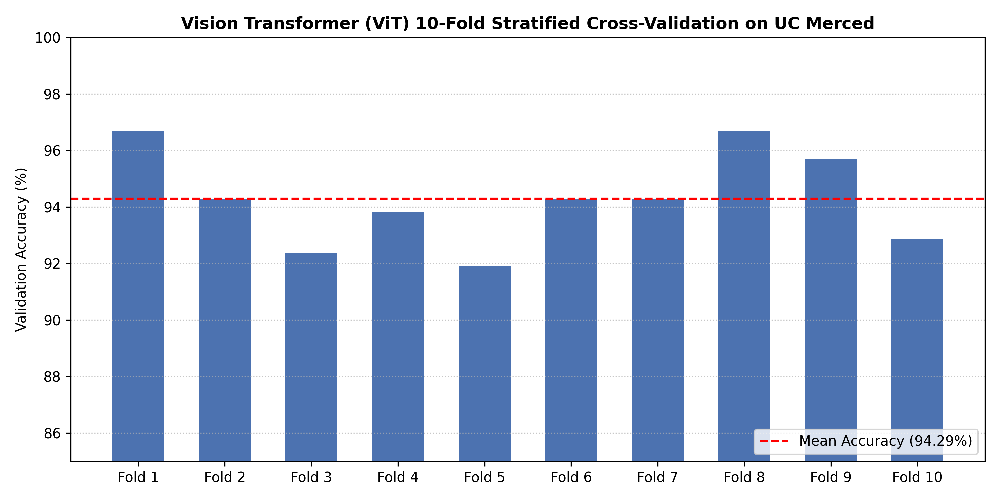
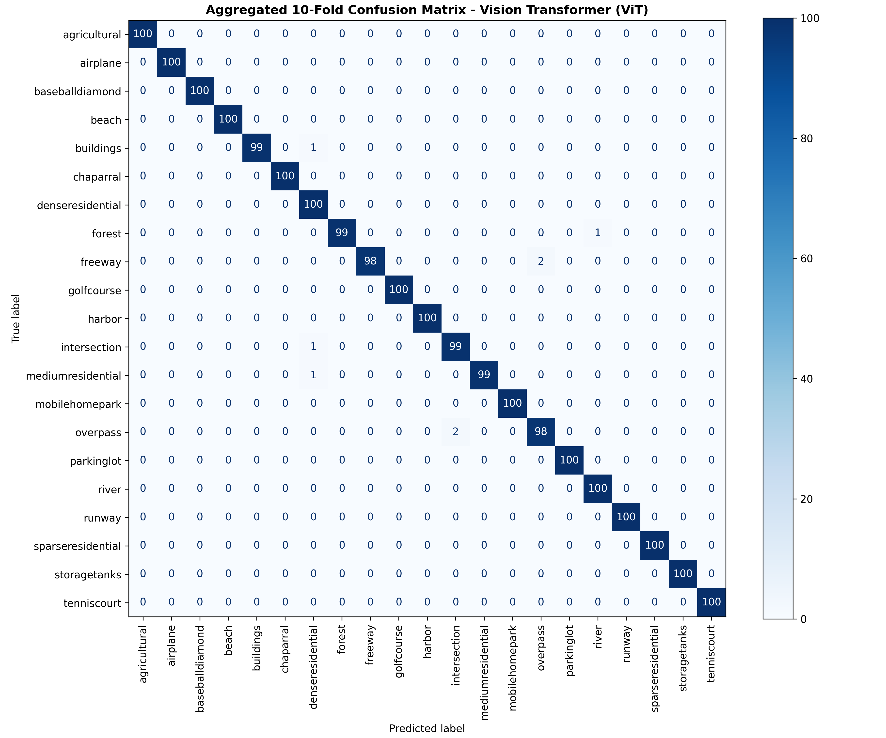
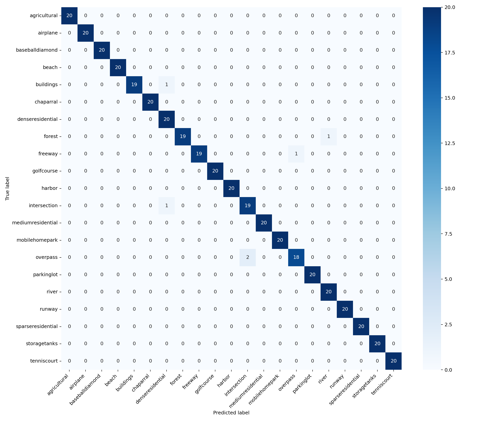
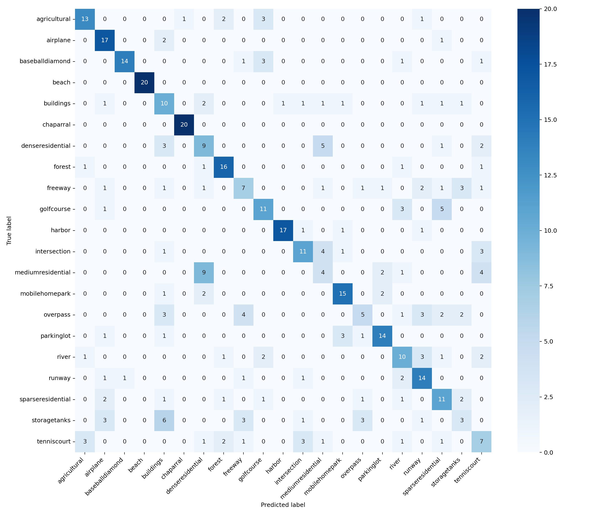
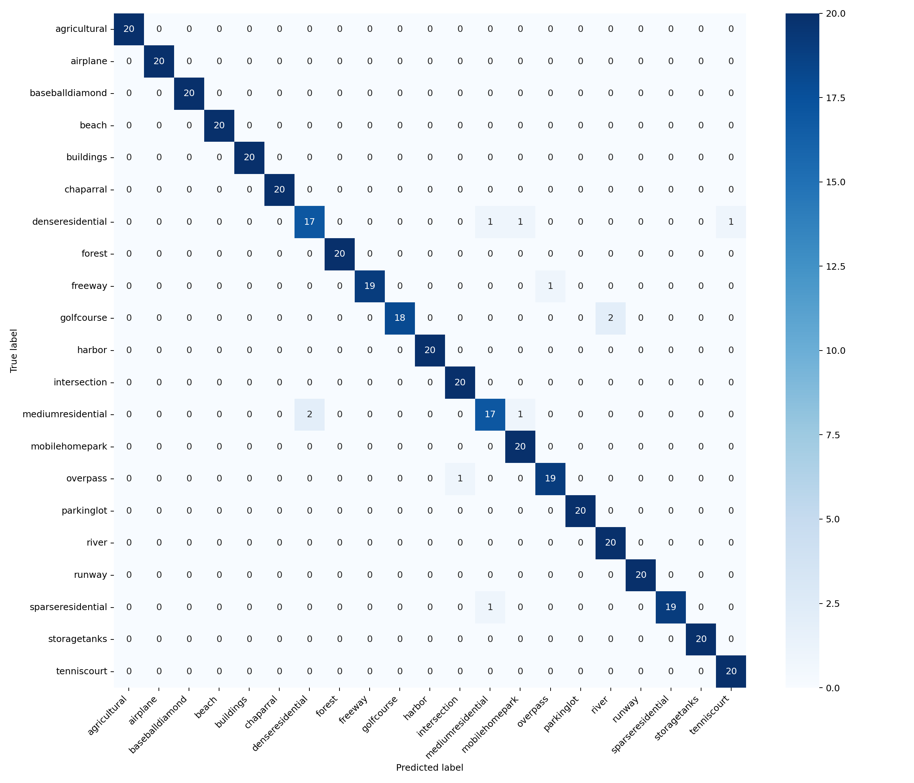

# GeoVision: Land-Use Classification & Benchmarking

GeoVision is an end-to-end deep learning framework for remote sensing land-use classification on the **UC Merced Land Use Dataset** (21 land-use classes, 2,100 high-resolution aerial images).

---

## 📊 10-Fold Stratified Cross-Validation Benchmark

To ensure rigorous performance evaluation without data leakage, the **Vision Transformer (ViT)** backbone was evaluated using **10-Fold Stratified Cross-Validation**.

| Fold | Accuracy (%) |
| :--- | :---: |
| **Fold 1** | 96.67% |
| **Fold 2** | 94.29% |
| **Fold 3** | 92.38% |
| **Fold 4** | 93.81% |
| **Fold 5** | 91.90% |
| **Fold 6** | 94.29% |
| **Fold 7** | 94.29% |
| **Fold 8** | 96.67% |
| **Fold 9** | 95.71% |
| **Fold 10** | 92.86% |
| **Mean Accuracy** | **94.29% ± 1.58%** |



### Aggregated 10-Fold Confusion Matrix (ViT)


---

## 📈 Baseline Architecture Confusion Matrices

### 1. Vision Transformer (ViT) Confusion Matrix


### 2. CNN Baseline Confusion Matrix


### 3. CNN-Transformer Hybrid Confusion Matrix


---

## 🛠️ Project Architecture

geovision-landuse-classification/
├── geovision/           # Core library module
│   ├── data.py          # PyTorch Dataset pipelines & Augmentations
│   ├── engine.py        # K-Fold Training & Validation engines
│   ├── models.py        # ViT, CNN, and Hybrid model definitions
│   └── utils.py         # Metrics calculation & visualization helpers
├── results/             # Benchmark plots, CSVs, and confusion matrices
├── config.json          # Experiment hyperparameter configurations
├── run_experiment.py    # Main training and evaluation script
└── README.md            # Project documentation


---

## 🚀 Quick Start

```bash
# Clone the repository
git clone [https://github.com/MuhammadAwaisArif/geovision-landuse-classification.git](https://github.com/MuhammadAwaisArif/geovision-landuse-classification.git)
cd geovision-landuse-classification

# Install dependencies
pip install -r requirements.txt

# Run 10-Fold Cross-Validation
python run_experiment.py --folds 10
