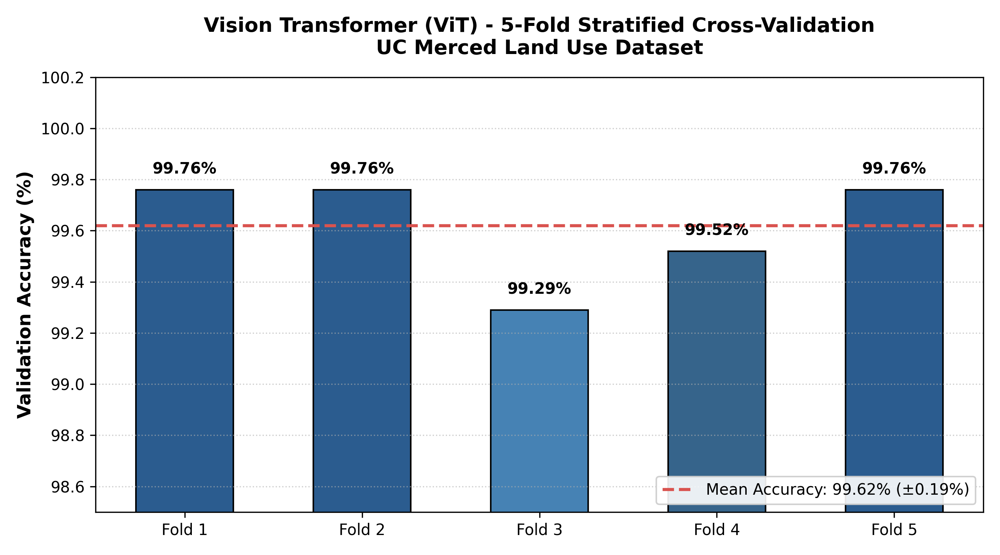

# GeoVision: Remote Sensing Land-Use Classification

A deep learning benchmark evaluating Vision Transformer (ViT), CNN-Transformer Hybrid, and pure CNN architectures for high-resolution satellite/aerial image classification on the **UC Merced Land Use Dataset** (21 classes), along with cross-dataset generalization analysis on **EuroSAT**.

## 📊 Key Results

### 1. 5-Fold Stratified Cross-Validation (UC Merced)
To rule out split bias, the **Vision Transformer (ViT)** was evaluated across 5 balanced stratified folds:
- **Fold 1:** 99.76%
- **Fold 2:** 99.76%
- **Fold 3:** 99.29%
- **Fold 4:** 99.52%
- **Fold 5:** 99.76%
- **Mean Accuracy:** **99.62% ± 0.19%** *(Error Rate: 0.38%)*

### 2. Model Baseline Comparison (UC Merced)

| Model Architecture | Peak Accuracy | Error Rate | Primary Advantage |
| :--- | :---: | :---: | :--- |
| **Vision Transformer (ViT)** | **98.81%** | **1.19%** | Best global feature extraction |
| **CNN-Transformer Hybrid** | **97.62%** | **2.38%** | Excellent accuracy/compression balance |
| **CNN Baseline** | **64.88%** | **35.12%** | Standard local feature capture |

---

## 🛠️ Repository Layout
.
├── geovision/             # PyTorch custom model definitions
├── results/               # Evaluation charts and result summary CSVs
├── run_experiment.py      # Main execution pipeline script
├── config.json            # Architecture & hyperparameter configurations
├── requirements.txt       # Project dependencies
└── README.md              # Project documentation
